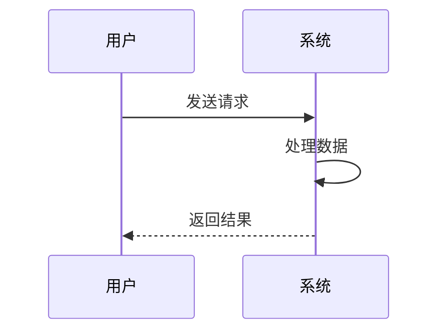
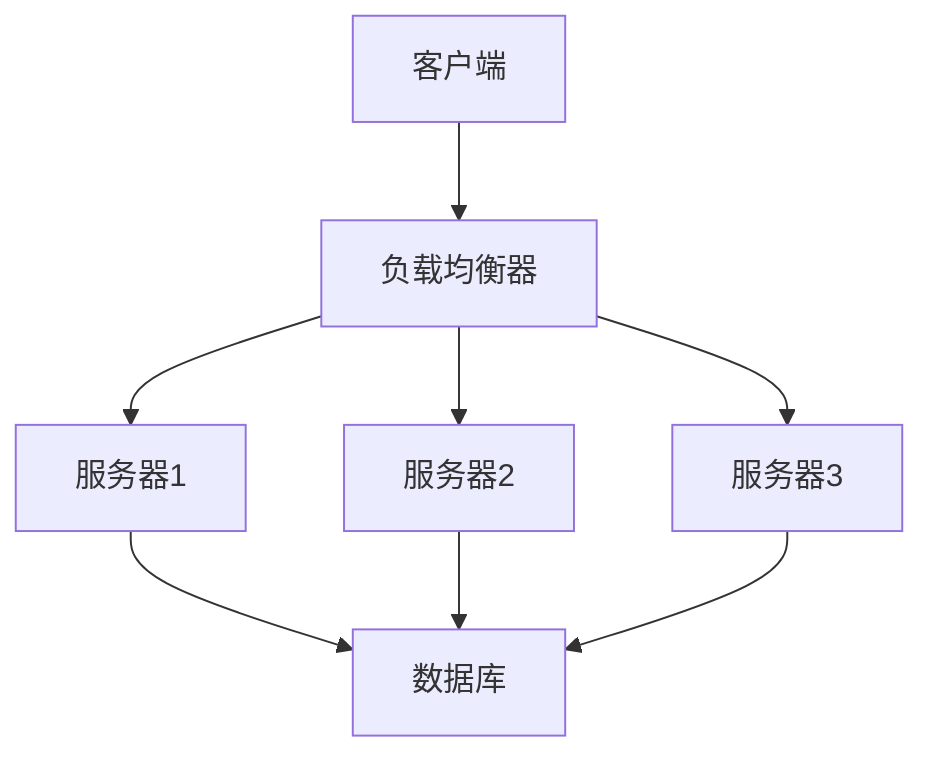
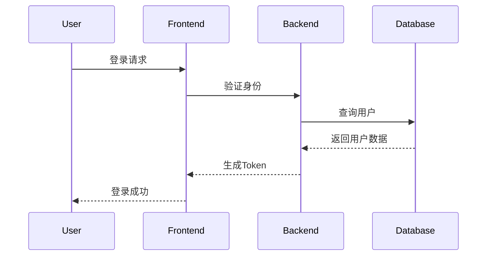
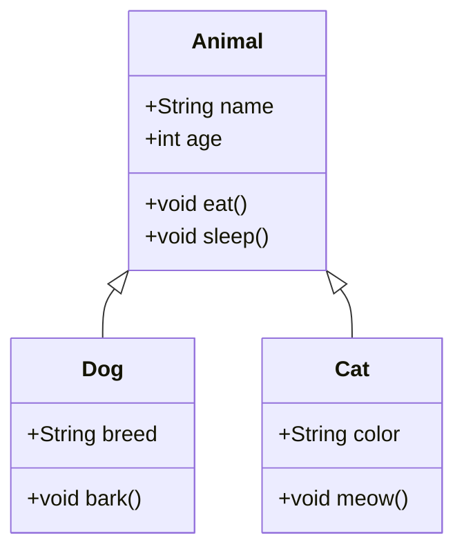
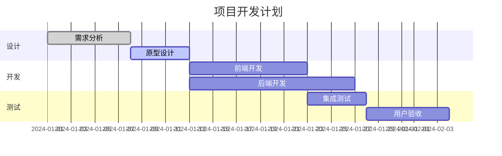

# Typecho Mermaid 插件

专注于 Mermaid 图表渲染的 Typecho 插件，提供完整、稳定、高性能的流程图、时序图、甘特图等图表渲染解决方案。

**当前版本：** v1.3.4

**相关文档：**
- [更新日志 (CHANGELOG.md)](CHANGELOG.md) - 详细的版本更新记录
- [插件开发指南 (PLUGIN_DEVELOPMENT_GUIDE.md)](PLUGIN_DEVELOPMENT_GUIDE.md) - Typecho 插件开发最佳实践

## 功能特性

- ✅ 支持 Mermaid 所有图表类型（流程图、时序图、类图、状态图、甘特图、饼图等）
- ✅ 智能按需加载资源，提升页面性能
- ✅ 多 CDN 源选择，确保访问稳定性
- ✅ 多种视觉主题可选
- ✅ 完整的移动端适配
- ✅ Pjax 单页应用兼容
- ✅ 打印样式优化
- ✅ 调试模式支持

## 支持的语法

### 1. HTML 标签语法

html

```
<div class="mermaid">
graph TD
    A[开始] --> B{判断}
    B -->|是| C[执行操作]
    B -->|否| D[结束]
    C --> D
</div>
```


### 2. Markdown 代码块语法

markdown

````

````


## 安装方法

1. 下载插件文件，将文件夹重命名为 `Mermaid` 并上传到 Typecho 的 `/usr/plugins/` 目录
2. 在 Typecho 后台启用插件
3. 根据需要配置插件选项

## 配置选项

### 核心设置

- **Mermaid 图表渲染**：选择加载模式（禁用/智能按需加载/强制加载）
- **Mermaid 主题**：选择图表的视觉主题（默认/暗黑/森林/中性）

### CDN 与性能

- **CDN 源选择**：选择资源加载的 CDN 服务商（jsDelivr/UNPKG/国内镜像）
- **懒加载**：延迟渲染图表直到进入视口

### 高级功能

- **Pjax 兼容**：支持单页应用动态重新渲染
- **调试模式**：在控制台输出调试信息

## 使用示例

### 流程图

markdown

````

````


### 时序图

markdown

````

````


### 类图

markdown

````

````


### 甘特图

markdown

````

````


## 技术特性

### 性能优化

- **智能检测**：仅在检测到 Mermaid 图表时加载相关资源
- **按需加载**：避免在无图表的页面加载额外资源
- **资源缓存**：利用 CDN 缓存提升加载速度

### 兼容性

- **浏览器支持**：支持所有现代浏览器
- **响应式设计**：完美适配桌面和移动设备
- **Pjax 支持**：兼容单页应用框架

### 可定制性

- **多主题支持**：内置多种视觉主题
- **灵活配置**：丰富的配置选项满足不同需求
- **扩展性强**：易于维护和功能扩展

## 常见问题

### Q: 图表没有显示怎么办？

A: 请检查以下事项：

1. 确保插件已启用
2. 检查语法是否正确
3. 查看浏览器控制台是否有错误信息
4. 尝试启用调试模式获取更多信息

### Q: 如何更换图表主题？

A: 在插件设置中选择不同的 Mermaid 主题即可。

### Q: 支持离线使用吗？

A: 插件依赖 CDN 加载 Mermaid 库，如需离线使用需要自行修改资源加载逻辑。

### Q: 图表在移动端显示不正常？

A: 插件已内置移动端优化，如仍有问题可尝试调整图表代码或通过 CSS 自定义样式。

## 更新日志

### v1.3.4 (当前版本)

- **重大修复**：修复主页列表页加载 mermaid 脚本导致布局错误的问题
- **重大修复**：修复文章页面 mermaid 解析失效的问题
- **功能增强**：增强摘要处理逻辑，双重防护确保主页正常
- **代码优化**：优化页面类型判断逻辑，移除冗余的调用栈检查
- **详细文档**：新增 `PLUGIN_DEVELOPMENT_GUIDE.md` 开发指南

### v1.3.3

- 修复按需加载模式下文章页 mermaid 无法渲染的问题
- 修复主页列表页布局错误问题（部分修复）
- 添加 `filterExcerpt` 过滤器拦截
- 增强 `parseExcerpt` 移除逻辑

### v1.3.2

- 修复 Markdown 代码块语法支持
- 移除短代码支持，专注于核心功能
- 优化性能检测逻辑

### v1.2.0

- 新增多 CDN 支持
- 添加懒加载功能
- 改进移动端适配

### v1.1.0

- 初始发布版本
- 支持基本图表渲染
- 提供基础配置选项

## 技术支持

如有问题或建议，请通过以下方式联系：

- 在插件发布页面提交 Issue
- 通过邮件联系开发者

## 许可证

本插件基于 MIT 许可证开源发布。